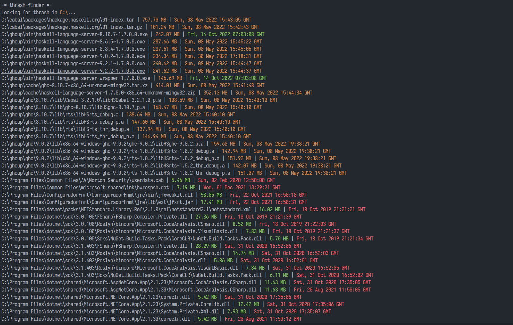

# scripts

A collection of scripts that I use in my daily basis. Most of them are done in [Node](https://nodejs.org/).

## thrash-finder

<center>
  
</center>

Looks for large and unused files to delete. Useful when you want something quick running in the background.

```txt
Usage:

  thrash-finder [options] <path>

-------------------------------------------------------------------

  Params:

    <path> The path to do the search. Use "." to search in current.

  Options:

    -e         Prompts errors when passed.
    -h, --help Prompts this message.
```
